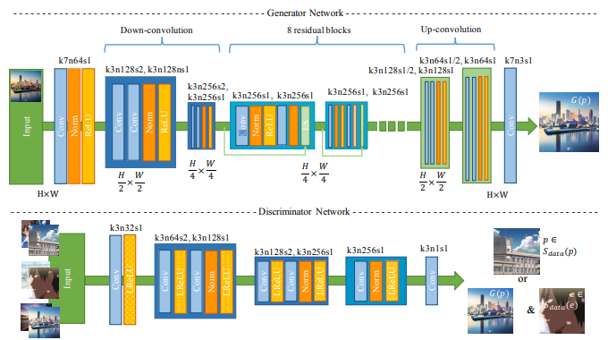

# Cartoon-Synthesization-using-Generative-Adversarial-Networks-GANs
## Stylization using Neural Networks
Convolutional Neural Networks (CNNs) have received considerable attention for solving many computer vision problems. Instead of developing specific NPR algorithms which require substantial effort for each style, style transfer has been actively researched. Unlike traditional style transfer methods which require paired style/non-style images, recent studies show that the VGG network trained for object recognition has good ability to extract semantic features of objects, which is very important in stylization. As a result, more powerful style transfer methods have been developed which do not require paired training images. Given a style image and a content image, Gatys et al. first proposed a neural style transfer (NST) method based on CNNs that transfers the style from the style image to the content image. They use the feature maps of a pre-trained VGG network to represent the content and optimize the result image, such that it retains the content from the content image while matching the texture information of the style image, where the texture is described using the global Gram matrix. It produces nice results for transferring a variety of artistic styles automatically. However, it requires the content and style images to be reasonably similar. Furthermore, when images contain multiple objects, it may transfer styles to semantically different regions. The results for cartoon style transfer are more problematic, as they often fail to reproduce clear edges or smooth shading.
## Image synthesis with GANs
A GAN framework consists of two CNNs. One is the generator G which is trained to produce output that fools the discriminator. The other is the discriminator D which classifies whether the image is from the real target manifold or synthetic.e the process of learning to transform realworld photos into cartoon images as a mapping function
which maps the photo manifold P to the cartoon manifold C. The mapping function is learned using training data 
`Sdata(p) = {pi|i = 1 . . . N} ⊂ P and Sdata(c) = {ci |i = 1 . . . M} ⊂ C`
where N and M are the numbers of photo and cartoon images in the training set, respectively. Like other GAN frameworks, a discriminator function D is trained for pushing G to reach its goal by distinguishing images in the cartoon manifold from other images and providing the adversarial loss for G. Let L be the loss function, G∗ and D∗ be the weights of the networks. Our objective is to solve the min-max problem:
`(G∗, D∗) = arg minGmaxDL(G, D)`
## Architecture of Generator and Discriminator with CNNs

